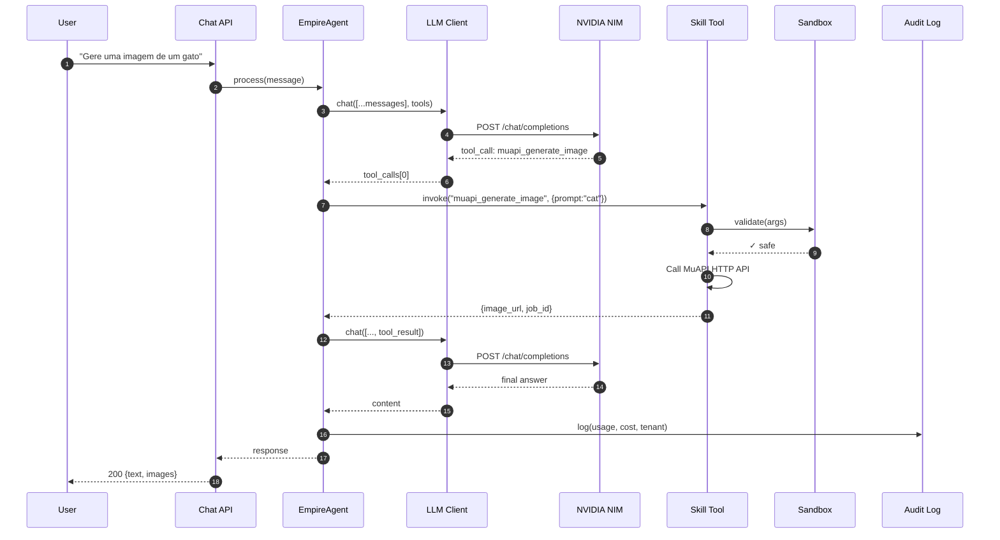

# Tool Calling Flow

```mermaid
sequenceDiagram
    autonumber
    participant User
    participant Chat as Chat API
    participant Agent as EmpireAgent
    participant Client as LLM Client
    participant NIM as NVIDIA NIM
    participant Skill as Skill Tool
    participant Sandbox as Sandbox
    participant Audit as Audit Log

    User->>Chat: "Gere uma imagem de um gato"
    Chat->>Agent: process(message)
    Agent->>Client: chat([...messages], tools)
    Client->>NIM: POST /chat/completions
    NIM-->>Client: tool_call: muapi_generate_image
    Client-->>Agent: tool_calls[0]
    Agent->>Skill: invoke("muapi_generate_image", {prompt:"cat"})
    Skill->>Sandbox: validate(args)
    Sandbox-->>Skill: ✓ safe
    Skill->>Skill: Call MuAPI HTTP API
    Skill-->>Agent: {image_url, job_id}
    Agent->>Client: chat([..., tool_result])
    Client->>NIM: POST /chat/completions
    NIM-->>Client: final answer
    Client-->>Agent: content
    Agent->>Audit: log(usage, cost, tenant)
    Agent-->>Chat: response
    Chat-->>User: 200 {text, images}
```

