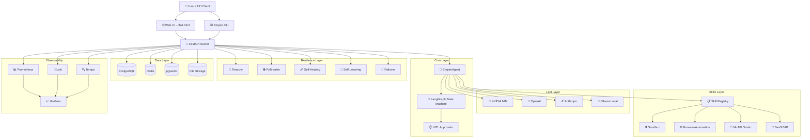
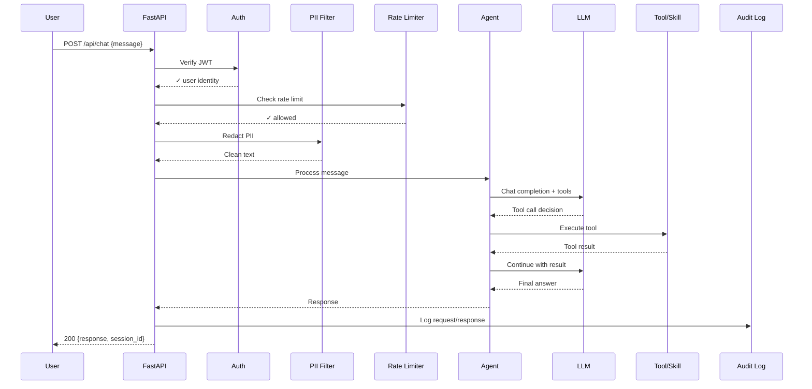
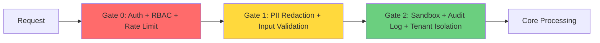
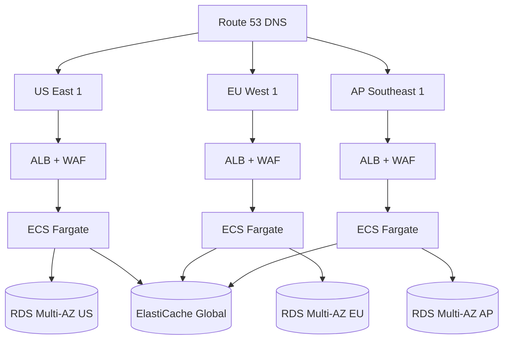

# AI Empire — System Architecture

## High-Level Overview

```mermaid
graph TB
    User[👤 User / API Client]
    UI[🌐 Web UI - chat.html]
    CLI[⌨️ Empire CLI]
    API[🚀 FastAPI Server]
    
    subgraph "Core Layer"
        Agent[🧠 EmpireAgent]
        LangGraph[🔄 LangGraph State Machine]
        HITL[✋ HITL Approvals]
    end
    
    subgraph "LLM Layer"
        NIM[🦆 NVIDIA NIM]
        OpenAI[🤖 OpenAI]
        Anthropic[🪶 Anthropic]
        Ollama[🦙 Ollama Local]
    end
    
    subgraph "Skills Layer"
        Reg[📋 Skill Registry]
        Sandbox[🔒 Sandbox]
        Browser[🌐 Browser-Automation]
        MuAPI[🎨 MuAPI Studio]
        SaaS[💼 SaaS B2B]
    end
    
    subgraph "Resilience Layer"
        Retry[🔁 Tenacity]
        Breaker[⛔ PyBreaker]
        Heal[🩹 Self-Healing]
        Learn[🧬 Self-Learning]
        FO[🚦 Failover]
    end
    
    subgraph "Data Layer"
        PG[(PostgreSQL)]
        Redis[(Redis)]
        Vectors[(pgvector)]
        Files[(File Storage)]
    end
    
    subgraph "Observability"
        Prom[📊 Prometheus]
        Loki[📜 Loki]
        Tempo[🔍 Tempo]
        Graf[📈 Grafana]
    end
    
    User --> UI
    User --> CLI
    UI --> API
    CLI --> API
    API --> Agent
    Agent --> LangGraph
    LangGraph --> HITL
    Agent --> Reg
    Reg --> Sandbox
    Reg --> Browser
    Reg --> MuAPI
    Reg --> SaaS
    Agent --> NIM
    Agent --> OpenAI
    Agent --> Anthropic
    Agent --> Ollama
    API --> Retry
    API --> Breaker
    API --> Heal
    API --> Learn
    API --> FO
    API --> PG
    API --> Redis
    API --> Vectors
    API --> Files
    API --> Prom
    API --> Loki
    API --> Tempo
    Prom --> Graf
    Loki --> Graf
    Tempo --> Graf
```

## Request Flow

```mermaid
sequenceDiagram
    participant U as User
    participant API as FastAPI
    participant Auth as Auth
    participant PII as PII Filter
    participant RL as Rate Limiter
    participant Agent as Agent
    participant LLM as LLM
    participant Tool as Tool/Skill
    participant Audit as Audit Log
    
    U->>API: POST /api/chat {message}
    API->>Auth: Verify JWT
    Auth-->>API: ✓ user identity
    API->>RL: Check rate limit
    RL-->>API: ✓ allowed
    API->>PII: Redact PII
    PII-->>API: Clean text
    API->>Agent: Process message
    Agent->>LLM: Chat completion + tools
    LLM-->>Agent: Tool call decision
    Agent->>Tool: Execute tool
    Tool-->>Agent: Tool result
    Agent->>LLM: Continue with result
    LLM-->>Agent: Final answer
    Agent-->>API: Response
    API->>Audit: Log request/response
    API-->>U: 200 {response, session_id}
```

## Security Layers (Defense in Depth)

```mermaid
graph LR
    R[Request] --> G0[Gate 0: Auth + RBAC + Rate Limit]
    G0 --> G1[Gate 1: PII Redaction + Input Validation]
    G1 --> G2[Gate 2: Sandbox + Audit Log + Tenant Isolation]
    G2 --> Core[Core Processing]
    
    style G0 fill:#ff6b6b
    style G1 fill:#ffd93d
    style G2 fill:#6bcf7f
```

## Multi-Region Deployment

```mermaid
graph TB
    DNS[Route 53 DNS]
    
    DNS --> US[US East 1]
    DNS --> EU[EU West 1]
    DNS --> AP[AP Southeast 1]
    
    US --> ALB1[ALB + WAF]
    EU --> ALB2[ALB + WAF]
    AP --> ALB3[ALB + WAF]
    
    ALB1 --> ECS1[ECS Fargate]
    ALB2 --> ECS2[ECS Fargate]
    ALB3 --> ECS3[ECS Fargate]
    
    ECS1 --> RDS_US[(RDS Multi-AZ US)]
    ECS2 --> RDS_EU[(RDS Multi-AZ EU)]
    ECS3 --> RDS_AP[(RDS Multi-AZ AP)]
    
    ECS1 --> Redis[(ElastiCache Global)]
    ECS2 --> Redis
    ECS3 --> Redis
```

